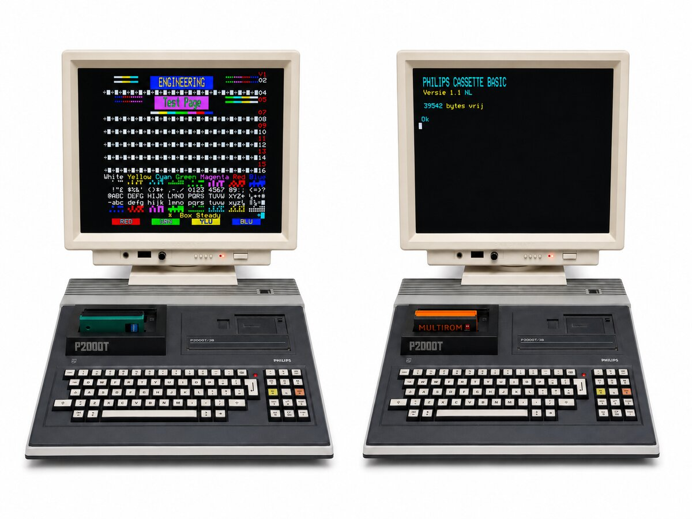

# P2000T video-to-VGA adapter



[](https://github.com/ifilot/p2000t-video-to-vga-adapter/actions/workflows/build.yml)
[](#license)
[](https://github.com/ifilot/p2000t-video-to-vga-adapter/releases/latest)

Hardware and firmware for converting the Philips P2000T RGBS output to
640×480 VGA using a Raspberry Pi Pico or Pico 2.

## Downloads

- [Latest Pico firmware](https://github.com/ifilot/p2000t-video-to-vga-adapter/releases/latest/download/p2000t-vid2vga-pico.uf2)
- [Latest Pico 2 firmware](https://github.com/ifilot/p2000t-video-to-vga-adapter/releases/latest/download/p2000t-vid2vga-pico2.uf2)
- [Latest Windows capture viewer installer](https://github.com/ifilot/p2000t-video-to-vga-adapter/releases/latest/download/p2000t-vid2vga-capture-windows-setup.exe)
- [Latest portable Windows capture viewer](https://github.com/ifilot/p2000t-video-to-vga-adapter/releases/latest/download/p2000t-vid2vga-capture-windows.zip)

## Features

- 480×240 RGBS capture using PIO and DMA
- Triple-buffered, frame-boundary VGA updates
- Horizontally qualified CSYNC capture
- 640×480 at 60 Hz RGB444 VGA output
- Three selectable on-screen signal-loss designs
- USB serial controls and capture statistics
- Pico 2 USB screen streaming at a target 25 FPS with a Qt 6 viewer
- Pico and experimental Pico 2 builds

## Building

Install the Arm GNU toolchain, CMake, and Ninja. On Ubuntu or Debian, install
the required build packages with:

```sh
sudo apt update
sudo apt install cmake ninja-build gcc-arm-none-eabi \
  libnewlib-arm-none-eabi libstdc++-arm-none-eabi-newlib git python3
```

CMake downloads the pinned Pico SDK 2.1.1, pico-extras 2.1.1, and required
host utilities into the ignored `.ci-dependencies` directory on first use.
Existing SDK checkouts can be selected instead by setting `PICO_SDK_PATH` and
`PICO_EXTRAS_PATH`.

Configure and build the Pico firmware:

```sh
cmake -S . -B build -G Ninja -DCMAKE_BUILD_TYPE=Release -DPICO_BOARD=pico
cmake --build build --parallel
```

For Pico 2, use a separate build directory:

```sh
cmake -S . -B cmake-build-pico2 -G Ninja \
  -DCMAKE_BUILD_TYPE=Release -DPICO_BOARD=pico2
cmake --build cmake-build-pico2 --parallel
```

The UF2 file is written below the build directory at
`src/p2000t-vid2vga-firmware.uf2`. GitHub Actions publishes separate Pico and
Pico 2 build artifacts plus a Windows viewer. Pushing a tag creates a GitHub
Release containing both UF2 files and the packaged viewer under stable,
version-independent filenames.

Both boards currently run at 252 MHz and 1.30 V to obtain exact 126 MHz
capture and 25.2 MHz VGA clocks. The Pico 2 configuration compiles but remains
an experimental overclock requiring hardware testing.

The firmware embeds concepts 04, 05, and 08 as compact 16-color RGB444
indexed images so their scanlines can be expanded within the VGA timing
deadline. Amber circuit is the power-on default. While connected over USB,
press `1` for green phosphor, `2` for synthwave, or `3` for amber circuit. The
choice takes effect atomically at the next VGA frame and is not persisted
across a power cycle.

The three final 640×480 previews and their matching firmware assets are kept
together in `assets/no_connection/`. Custom 640×480 artwork can be encoded
with `tools/encode_no_connection.py` after installing Pillow.

## USB controls

Connect to the Pico USB serial port and press `h` for help. Useful commands are
`s` for status, `[`/`]` for vertical position, `,`/`.` for sample phase, and
`<`/`>` for horizontal position. Use `1`, `2`, or `3` to select the
no-connection artwork. Phase 0 is the default.

On Pico 2, `c` starts the recommended continuous PackBits screen stream and
`r` starts an uncompressed stream. Press `q` or Escape to stop binary mode and
return to the console. The alignment and artwork commands remain available
silently while a binary stream is active, allowing the desktop viewer to
configure the adapter without interrupting capture. Screen streaming is
intentionally excluded from the Pico/RP2040 build for now so its limited SRAM
and established VGA timing remain unchanged.

## Pico 2 desktop capture viewer

The compact Qt 6 application in [`gui`](gui/) discovers Pico USB CDC ports,
starts the 480×240 RGB111 stream, validates CRC-32, displays complete frames,
and saves lossless PNG captures. At startup it attempts to connect to the first
detected Pico port automatically. Its Adapter menu can adjust vertical
position, sample phase, horizontal start, no-connection artwork, and all eight
RGB444 source colors while the screen stream remains active. The interactive
configuration dialog uses exact numeric controls, can restore the last saved
configuration, and can persist the current settings in CRC-protected Pico
flash for the next boot. File > Exit and Help > About provide standard desktop
application actions. Each source scanline is duplicated exactly, so
the 480×240 logical source is shown and saved as a square-pixel 480×480 image.
PackBits is selected per frame only when it is smaller than the 43,200-byte raw
payload. USB backpressure can reduce the frame rate, but it cannot expose a DMA
buffer that capture is overwriting or make VGA display a partial frame.

When the P2000T input signal disappears, the firmware sends a header-only
state record rather than stale pixels. It identifies the no-connection artwork
actually adopted by the VGA core. The viewer embeds the same three RGB444
artwork previews and shares the firmware's bitmap font and overlay layout, so
it reproduces the complete 640×480 VGA no-connection screen locally. Changing
artwork with `1`, `2`, or `3` sends a new state record without the bandwidth
cost of retransferring artwork already packaged with the viewer.

Build the Windows executable from an MSYS2 UCRT64 shell:

```sh
pacman -S --needed mingw-w64-ucrt-x86_64-toolchain \
  mingw-w64-ucrt-x86_64-cmake mingw-w64-ucrt-x86_64-ninja \
  mingw-w64-ucrt-x86_64-qt6-base
cmake -S gui -B build-gui -G Ninja \
  -DCMAKE_BUILD_TYPE=Release -DBUILD_TESTING=ON
cmake --build build-gui --parallel
ctest --test-dir build-gui --output-on-failure
```

See [gui/README.md](gui/README.md) for deployment with `windeployqt6`.

The graphical Windows installer follows the P2000M viewer's NSIS packaging
model: it installs under Program Files, creates desktop and Start-menu
shortcuts, upgrades the same installation directory, and provides a standard
Windows uninstaller. GitHub Actions builds the installer on every push and
pull request, validates its archive, then tests a silent fresh install,
same-directory upgrade, and uninstall before retaining the artifact. The
portable ZIP remains available for users who prefer not to install anything.

Each binary record begins with a 48-byte little-endian header carrying the
`P2TF` magic, protocol and encoding versions, source sequence, 480×240
geometry, signal state, selected no-connection artwork, payload size, and
CRC-32. The reconstructed payload contains three 14,400-byte, MSB-first
bitplanes in red, green, blue order. No-signal state records have no payload.
Records are independently recoverable, so a viewer can resynchronize after
opening a port mid-stream.

Structured 12-byte control packets coexist with the original one-character
terminal commands. Configuration replies use independently framed `P2TF`
records with a CRC-32-protected 32-byte state payload. Palette lookup tables
are triple-buffered so a new eight-color palette is adopted at a VGA frame
boundary rather than partway through a frame.

## License

Firmware and viewer sources are
[GPL-3.0-or-later](LICENSES/GPL-3.0-or-later.txt). Hardware design files are
licensed under CERN-OHL-S-2.0; see [pcb/LICENSE.md](pcb/LICENSE.md).
